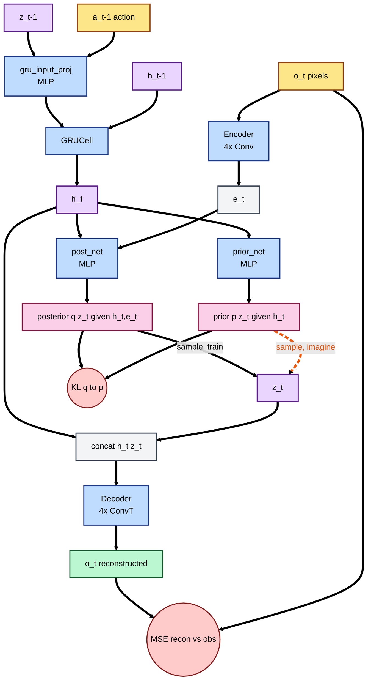

# Architecture & Data Flow

The world model is five sub-modules wired into a recurrent loop: `Encoder`, `gru_input_proj + GRUCell`, `prior_net`, `post_net`, `Decoder`.



Solid arrows = **observe / training** path. Dashed orange arrow = **imagine** path (eval, no observations).

## The GRU (deterministic backbone)

`h_t` is the model's *memory*. It carries information forward through time so the next step doesn't restart from scratch. A GRU (Gated Recurrent Unit) is a small neural cell that, at each step, decides:

- **how much of the previous memory `h_{t-1}` to keep** (update gate),
- **how much of the new input to mix in** (reset gate + candidate state).

Concretely:

```
x_t = MLP([z_{t-1}, a_{t-1}])         # gru_input_proj, src/rssm.py:42
h_t = GRUCell(x_t, h_{t-1})           # src/rssm.py:43
```

The input `x_t` is the previous stochastic latent and the action — i.e. "what I thought the world was, plus what I just did." `h_t` is deterministic: given the same `(h_{t-1}, z_{t-1}, a_{t-1})`, you always get the same `h_t`. That makes the trajectory of `h` stable and easy to predict; the stochasticity is isolated in `z`.

## The Gaussian prior

The prior is the model's **belief about the next latent before it sees the observation**: a diagonal Gaussian whose parameters are read off the memory `h_t`.

```
mu, raw = prior_net(h_t).chunk(2)     # src/rssm.py:45
std = softplus(raw) + min_std         # 0.1 floor keeps it from collapsing
p(z_t | h_t) = Normal(mu, std)
z_t ~ p   (during imagination)        # src/rssm.py:63-67
```

Why a Gaussian, and why a *prior* at all? Two reasons:

1. **Imagination needs a generator.** At eval time there are no observations, so `z_t` has to come from somewhere — it's sampled from `p`.
2. **It forces the world to be predictable.** During training, the KL term `KL(q ‖ p)` pulls the prior toward the posterior. After training, the prior approximates "what the posterior would have inferred from the next frame," so prior-only rollouts stay coherent for a while before drifting.

The `free_nats=3.0` clamp on the KL prevents posterior collapse: the optimizer is only pushed to reduce KL once it exceeds 3 nats, leaving the posterior some room to actually carry information about the observation.

## Two execution modes

Same modules, different source of `z_t`.

| Mode        | Caller                              | `z_t` from | Used for                                |
| ----------- | ----------------------------------- | ---------- | --------------------------------------- |
| **Observe** | `WorldModel.observe` (world_model.py:39) | posterior `q` | training, posterior reconstruction video |
| **Imagine** | `WorldModel.imagine` (world_model.py:64) | prior `p`     | rollout video — no observations available |

## Training step (per 50-frame chunk)

See `WorldModel.loss` at `src/world_model.py:81`.

1. **Encode** all `B·T` frames in one batched conv pass → `e_seq` of shape `(B, T, 1024)`.
2. **Recurrent posterior loop**, `T` iterations:
   - `h_t = GRU(gru_input_proj([z_{t-1}, a_{t-1}]), h_{t-1})`
   - `p_t = prior_net(h_t)` → Normal
   - `q_t = post_net([h_t, e_t])` → Normal
   - `z_t = q_t.rsample()`
3. **Decode** flattened `(h, z)` features → reconstruction `(B, T, 3, 64, 64)`.
4. **Loss** = `MSE(recon, obs) + kl_weight · clamp(KL(q ‖ p), min=free_nats)`.

## Tensor shape cheat-sheet

Defaults from `config.yaml`:

| Symbol | Shape            | Meaning                                       |
| ------ | ---------------- | --------------------------------------------- |
| `o_t`  | `(B, 3, 64, 64)` | RGB observation                               |
| `a_t`  | `(B, 2)`         | one-hot action (CartPole has 2 discrete acts) |
| `e_t`  | `(B, 1024)`      | encoder embedding (256·2·2 flattened)         |
| `h_t`  | `(B, 200)`       | GRU hidden state                              |
| `z_t`  | `(B, 30)`        | stochastic Gaussian latent                    |
| `[h,z]`| `(B, 230)`       | decoder input feature                         |
