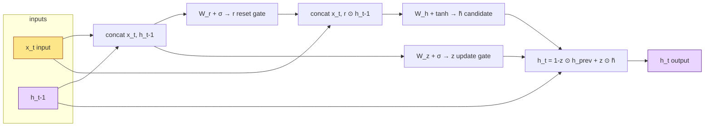
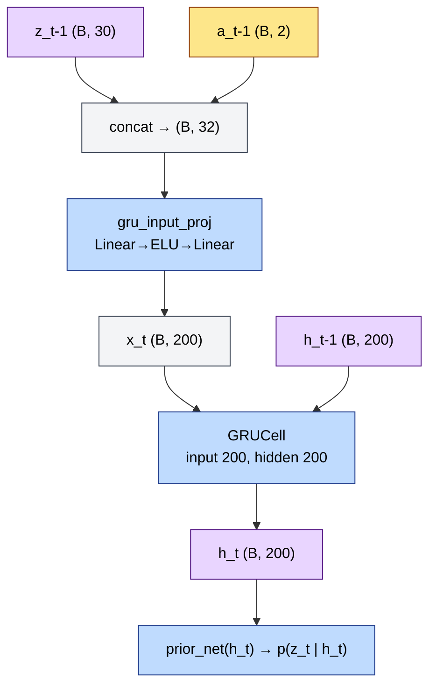

# The Gated Recurrent Unit (GRU)

## The Core Idea

A GRU is a small recurrent cell that maintains a **hidden state** `h` across time steps. At each step it reads an **input** `x` and the **previous hidden state** `h_{prev}`, then outputs an updated `h`. Unlike a plain RNN, which always overwrites its memory, a GRU uses **gates** — learned scalars in `(0, 1)` per dimension — to choose how much old memory to keep and how much new information to write.

In this project, the GRU is the **deterministic backbone** of the RSSM: `h_t` accumulates history while stochastic uncertainty lives in `z_t`. See [`rssm_explained.md`](rssm_explained.md) for the full world-model picture.

## Inside One GRU Step

PyTorch's `nn.GRUCell` implements the standard formulation. Given input `x_t` and previous hidden `h_{t-1}`:

| Gate / state | Role |
|---|---|
| **Reset gate** `r` | Controls how much of `h_{t-1}` enters the *candidate* computation (0 = ignore past, 1 = use full past). |
| **Update gate** `z` | Blends old hidden state with the candidate (0 = keep `h_{t-1}`, 1 = take candidate). *Not* the RSSM latent `z_t` — naming collision only. |
| **Candidate** `h̃` | Proposed new content from the current input (and optionally reset-masked past). |

```
r_t   = σ(W_r · [x_t, h_{t-1}] + b_r)
z_t   = σ(W_z · [x_t, h_{t-1}] + b_z)          # update gate (GRU notation)
h̃_t  = tanh(W_h · [x_t, r_t ⊙ h_{t-1}] + b_h)
h_t   = (1 - z_t) ⊙ h_{t-1} + z_t ⊙ h̃_t
```

Here `σ` is the sigmoid, `⊙` is element-wise product, and `[·, ·]` is concatenation. The update gate `z_t` here is **unrelated** to the RSSM's Gaussian latent `z_t`; the RSSM doc uses `z` for the stochastic latent only.

### Intuition

- **High update gate** → replace more of the old `h` with the candidate (react quickly to new input).
- **Low update gate** → preserve `h_{t-1}` (stable memory across steps).
- **Reset gate** → temporarily "forget" parts of `h_{t-1}` when forming the candidate, useful when the relevant context is mostly in `x_t`.



## GRU in This Project (RSSM)

The RSSM does **not** feed raw pixels into the GRU. The previous stochastic latent and action are projected first, then passed to `GRUCell`:

```
x_t = gru_input_proj([z_{t-1}, a_{t-1}])    # MLP: (30+2) → 200 → 200
h_t = GRUCell(x_t, h_{t-1})                 # hidden size 200
```

Implementation: `RSSM._step_h` in `src/rssm.py`.



After `h_t` is computed, `prior_net` and (during training) `post_net` read from `h_t` — the GRU never sees the observation embedding `e_t` directly. Observations influence `h` only **indirectly** on the next step, via the sampled `z_t` that gets fed back into `gru_input_proj`.

## Why a GRU Here (Not Just an MLP)?

| Property | GRU `h_t` | Stochastic `z_t` |
|---|---|---|
| Role | Long-horizon **memory** across the rollout | Per-step **uncertainty** / variation |
| Given same inputs | Deterministic | Sampled from a Gaussian |
| Fed into decoder | Yes (`[h_t, z_t]`) | Yes |
| Sees observation at step `t` | No (only via `z_{t-1}` on the next step) | Yes, in posterior `q(z_t \| h_t, e_t)` |

Separating deterministic history (`h`) from stochastic per-step latents (`z`) is the Dreamer/RSSM design: `h` stays predictable for multi-step imagination; `z` captures what a single frame might not fully determine.

## Unrolled Over Time

For a sequence of length `T` (default `seq_len=50`), the same cell is applied `T` times with carried state:

```
(h_0, z_0) = (0, 0)     # init_state in rssm.py
for t = 1 … T:
    h_t = GRUCell(gru_input_proj([z_{t-1}, a_{t-1}]), h_{t-1})
    … sample z_t from prior or posterior …
```

Gradients flow back through all `T` GRU steps (backprop through time). That is why training uses fixed-length chunks from the replay buffer rather than single frames.

## Tensor Shape Cheat-Sheet

Defaults from `config.yaml` / `src/rssm.py`:

| Symbol | Shape | Meaning |
|---|---|---|
| `z_{t-1}` | `(B, 30)` | Previous stochastic latent |
| `a_{t-1}` | `(B, 2)` | One-hot CartPole action |
| `x_t` | `(B, 200)` | Projected GRU input (`hidden_dim`) |
| `h_{t-1}`, `h_t` | `(B, 200)` | GRU hidden state (`h_dim`) |
| GRU weights | `W_*` → `(3·200, 200+200)` | PyTorch fuses `W_r, W_z, W_h` internally |

Batch size `B` is `train.batch_size` (16) during training.

## GRU vs LSTM (Short)

| | GRU | LSTM |
|---|---|---|
| Gates | 2 (reset, update) + candidate | 3 (input, forget, output) + cell state |
| State | Single vector `h` | Hidden `h` + cell `c` |
| Parameters | Fewer | More |
| Typical use | Sufficient for many sequence models; used in Dreamer RSSM | Extra memory lane when very long dependencies matter |

This codebase uses `nn.GRUCell` deliberately to match the original Dreamer RSSM.

## Related Docs

- [`architecture.md`](architecture.md) — full RSSM data-flow diagram (encoder, GRU, prior/posterior, decoder).
- [`rssm_explained.md`](rssm_explained.md) — prior vs posterior, imagination, and failure modes.
